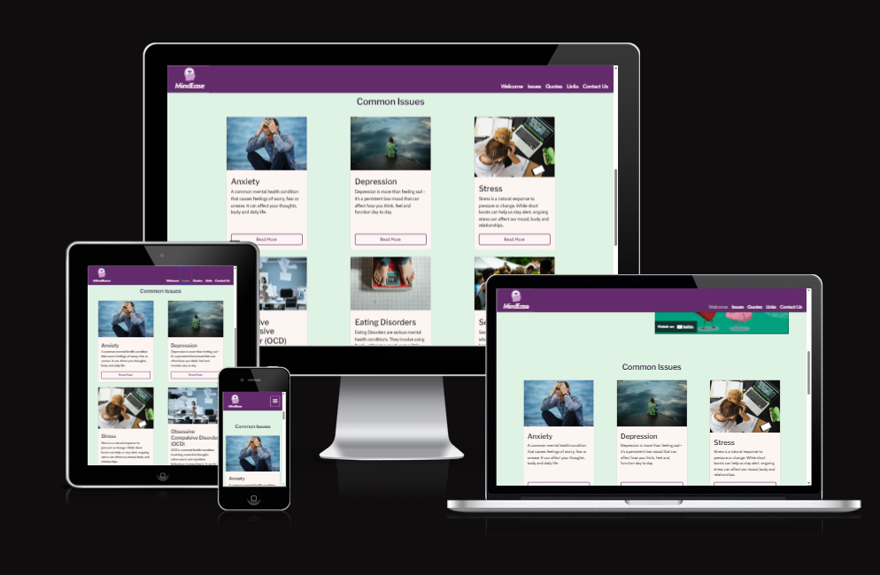
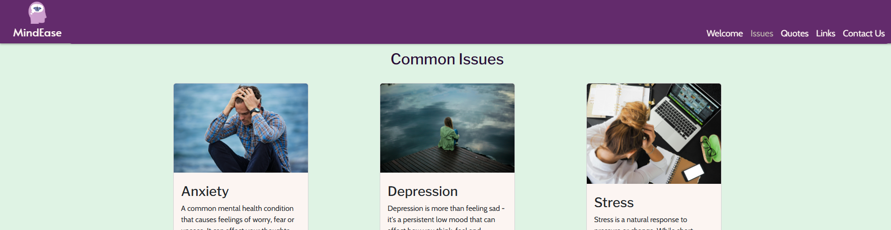
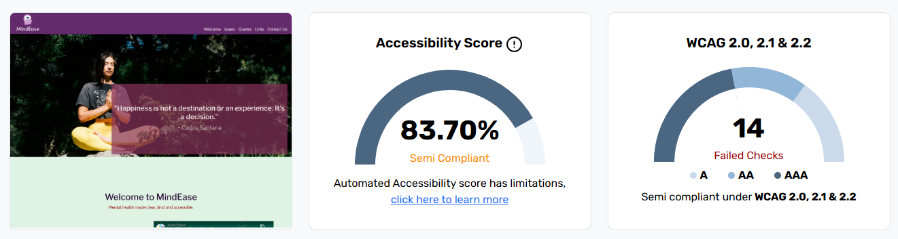
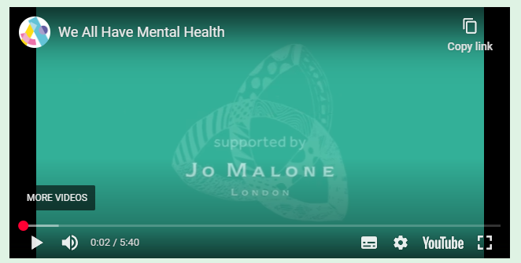

# [MindEase](https://fspruce.github.io/mind-ease/)

## Table Of Contents:

1. [Design & Planning](#design-&-planning)
   - [User Stories](#user-stories)
   - [Wireframes](#wireframes)
   - [Typography](#typography)
   - [Colour Scheme](#colour-scheme)
2. [Features](#features)

   - [Navigation](#Navigation)
   - [Footer](#Footer)
   - [Home page](#Home-page)
   - [Other features](#Other-features)

3. [Technologies Used](#technologies-used)
4. [Testing](#testing)
5. [Bugs](#bugs)
6. [Deployment](#deployment)
7. [Credits](#credits)

## Design & Planning:

### User Stories

| **User Story**                          | **Acceptance Criteria**                                                                                                                                                                                                                           | **Tasks**                                                                                                                                                                                                        | **Label** |
| --------------------------------------- | ------------------------------------------------------------------------------------------------------------------------------------------------------------------------------------------------------------------------------------------------- | ---------------------------------------------------------------------------------------------------------------------------------------------------------------------------------------------------------------- | --------- |
| Responsive Layout                       | - Content reorganises itself at various breakpoints.<br>- No horizontal scrollbars appear on any common screen size.<br>- Text and buttons remain legible and tappable.                                                                           | - Adopt a grid-based layout that responds to mobile, tablet, and desktop widths.<br>- Adjust typography and spacing for readability on smaller screens.<br>- Test layout integrity using Chrome Developer Tools. | Must      |
| Clear Main Navigation Menu              | - A persistent nav bar appears at the top of the page, and stays visible as users scroll.<br>- Users can click or tap any link to jump directly to that section.<br>- On narrow screens, the menu collapses.<br>- Current section is highlighted. | - Design an intuitive menu structure mapping to each page section.<br>- Implement responsive behaviour for hamburger toggle on small screens.<br>- Add smooth scrolling and active-link highlighting.            | Must      |
| Calming Hero Section                    | - A prominent hero area displays an uplifting headline and sub-headline.<br>- Background imagery or calming colour fills the space without obscuring text.<br>- Text remains legible on all devices.                                              | - Select or create a soothing background and supportive headline.<br>- Style the hero for clarity and positive tone.<br>- Verify readability across viewports.                                                   | Must      |
| Accessibility Available Throughout Site | - All text and interactive elements meet minimum contrast ratios.<br>- Every image or icon has a descriptive text alternative.<br>- Semantic HTML markup supports accessibility.                                                                  | - Define and apply an accessible colour palette.<br>- Audit and add alt text for images.<br>- Use semantic HTML structures.                                                                                      | Must      |
| Information Cards for Tips & Issues     | - Tips appear in consistent card-style groupings under clear headings.<br>- Cards display multiple per row on wide screens and stack on narrow ones.<br>- Text within cards is concise and wraps correctly.                                       | - Design reusable card templates.<br>- Organise cards under headings (e.g. "Stress", "Anxiety").<br>- Ensure responsive card layout.                                                                             | Should    |
| Resource Links Styled as Buttons        | - Resource links appear as prominent buttons.<br>- Buttons are evenly spaced and responsive.<br>- Links open in new tabs.                                                                                                                         | - Define button styles for external links.<br>- Lay out buttons in a clean grid.<br>- Verify tap areas and link behaviour across devices.                                                                        | Should    |
| Positive Affirmations Section           | - Section displays multiple uplifting quotes.<br>- Quotes are visually distinct and spaced clearly.<br>- Section fits with overall design.                                                                                                        | - Curate uplifting messages.<br>- Design and position the affirmations block.<br>- Fine-tune typography and spacing.                                                                                             | Could     |
| Media Play/Pause Controls               | - Embedded media includes visible play/pause controls.<br>- Playback is user-initiated.<br>- Controls are keyboard and touch accessible.                                                                                                          | - Embed media with standard controls.<br>- Disable autoplay.<br>- Test accessibility across devices.                                                                                                             | Could     |

### Wireframes

A larger-scale image of the wireframes can be found [here](documentation/images/MindEase%20Wireframe.png)
.png>)

### Typography

Google fonts have been chosen to keep to a warm and inviting aesthetic, while maintaining the professionalism of the website:

- Logo: Alata
- Headings: Libre Franklin
- Body: Cabin

### Colour Scheme


## Features:

### Navigation

Navigation bar fixed to the top of the site regardless of user position. Contains site logo and links to sections within the page. Scrollspy implemented to show active sections within the navbar.

### Header

Contains a calming hero image, with a quote overlain on top to draw users in, and remind them that it's their hard work that will pay off.

### Main Content

#### Welcome Section

Contains a short introduction to the page, and a video for users to find out more about mental health. The video is more catered towards child audiences, but would be updated to something original if not for this being a demo website.

#### Common Issues

Contains cards with brief information regarding common mental health issues users may be facing. The user can then open a modal through the button in the card to find more detailed information regarding the issue, as well as a relevant link for further support. The modal also contains arrows that allow the user to move between the information once one modal has been opened.

#### Quotes

An autoplaying carousel of images showing uplifting quotes over images of the people who said them. Users can also move back and forth between the images if they wish to.

#### Useful Links

Buttons which open modals with a brief description of what the services the organisations provide, with a link to their websites. Buttons contain icons to help make them stand out, and show the main aspects of the service (e.g. Shout has a mobile and speech bubble to show that it is a texting service, whereas Samaritans has telephones to show that its a calling service).

### Footer

Contains contact details and links to social medias (directs to homepages since this is just a demo website). Button to bring up form to sign up for a newsletter (validation present, but data not stored), with success message when submitted.

### Other features

Site is fully responsive to different screen sizes, with sections resizing and grid layout changing to fit the screen. Care has been taken to include as much accessibility options as possible for users who may need it. All links open in a new tab.

## Technologies Used

- HTML: for main page creation.
- CSS: for custom styling.
- Bootstrap: for pre-made widgets, like cards.
- Git: to create commits and push to GitHub.
- GitHub: to host the site files and deploy the site.

## Testing

### Google's Lighthouse Performance

Screenshots of certain pages and scores (mobile and desktop)

### Browser Compatibility


- Overall no errors for browser compatibility.
- Errors shown in table stem from empty hrefs which I have added to get the styling I wanted, but keep the user in the same place once they have clicked the link, such as within custom modal closing buttons.

### Responsiveness



- The website is fully responsive on common devices, such as mobiles, tablets and desktops. 

### Code Validation
#### HTML

- No errors present.
- Warnings present mainly due to bootstrap's card template using \<h1> tags in their headings.

#### CSS

- No errors present.

### Manual Testing user stories or/and features

| **User Story**                          | **Test** | **Pass** | **Screenshots** |
| --------------------------------------- | -------- | -------- | -----------------|
| Responsive Layout                       | Grid layout used - DevTools used to check responsiveness, layouts work on mobile, tablets and desktops.         |  &check; | |
| Clear Main Navigation Menu              | Navbar sticks to the top of the screen, and each link in the navbar is highlighted as the user reaches that section.         |  &check; |  |
| Calming Hero Section                    | Calming image of a person meditating used as the hero image, with a mindful quote overlain on top.         |  &check; |  |
| Accessibility Available Throughout Site | Accessibilty features (such as alt. texts, aria-labels, etc.) implemented from the start, with AI used at the end to check that all elements of the site are as accessible as possible. Accessibility validation performed with a score of 83.7%, with some errors appearing due to bootstrap.  |  &check; |  |
| Information Cards for Tips & Issues     | Common issues section contains cards, each card contains a brief overview of the issue with a "read more" button opening a more detailed modal.         |  &check; |   |
| Resource Links Styled as Buttons        | Useful Links section contains buttons for individual support sites. These buttons open modals so the user knows what each site is aimed towards, but each modal also has a styled button to link to the site.         |  &check; |   |
| Positive Affirmations Section           | Section not included in the final project - did not feel like it fit with the website.         |  &#x58;  | Section not included in the final project. |
| Media Play/Pause Controls               | Media provided through embedded YouTube link, which contains its own play/pause controls. This seemed the better option as it allowed for YouTube's closed-captioning to be available for further accessibility.        |  &check; |  |

## Bugs

- Custom navbar styling caused toggle menu for mobiles to lose its background, copilot used to find the error. Background then changed to the same color as the navbar.

- Contact Us link in navbar not picked up by the scroll spy feature. Error caused by links section being before the footer, and the contact section being in the footer (can not scroll further than the bottom of the page and so contact us section isn't target as active).

- Collapse menu persitant after navigating to section on small screens, javascript taken from boardwalk games walkthrough project to fix.

- Background image in hero section was not resizing to fit the screen properly at different screen sizes, AI used to help with zoom percentages.

- Quotes carousel images less clear on smaller screens, can be fixed with different res images showing for different screen sizes.

- Modals outside of the card section were not styled in the same way as those in the card section. Less specific targeting styles applied.

- Footer divs were changing col size earlier than expected (at 1000px instead of 1200px), media query targeting their order updated to reflect this.

- Footer divs misaligned, elements not nested in the grid properly.

- **Newsletter:** For form validation, form tag is needed. However, upon submission of the form, the page refreshes. As such, a success modal could not pop up after the form had been submitted. Without using JavaScript, and keeping to the one page brief, pseudo-classes have been used to "fake" a success modal pop up.

## Deployment

#### Creating Repository on GitHub

- First make sure you are signed into [Github](https://github.com/).
- Then click on **Create a new repository** from the drop-down. Enter the name for the repository and click **Create repository from template**.
- Once the repository was created, I cloned the repository to my **VSCode** so that I could start working on it.

#### Deloying on Github

The site was deployed to Github Pages using the following method:

- Go to the Github repository.
- Navigate to the 'settings' tab.
- Using the 'select branch' dropdown menu, choose 'main'.
- Click 'save'.

The deployment page can be found [here](https://fspruce.github.io/mind-ease/).

## Credits

#### Code and Text Content

- Collapsable mobile navbar script provided by Code Institute from the Boardwalk Games walkthrough project.

```
<script>
  document
    .querySelectorAll(".navbar-collapse .nav-link")
    .forEach((link) => {
      link.addEventListener("click", function (e) {
        let section = document.querySelector(e.target.getAttribute("href"));
        if (section) {
          e.preventDefault();
          let navbarHeight =
            document.querySelector(".navbar-toggler").offsetHeight;
          window.scroll({
            top: section.offsetTop - navbarHeight,
            behavior: "smooth",
          });
          document
            .querySelector(".navbar-collapse")
            .classList.remove("show");
        }
      });
    });
</script>
```
- Information regarding mental health and the sites in which to find resources sourced from:
  - [Mind](https://www.mind.org.uk/)
  - [NHS](https://www.nhs.uk/)
  - [Mental Health Foundation](https://www.mentalhealth.org.uk/)
  - [Young Minds](https://www.youngminds.org.uk/)
  - [Shout](https://giveusashout.org/)
  - [Samaritans](http://samaritans.org/)
  - [Switchboard](https://switchboard.lgbt/)
#### Media

- Images found through [Pexels](http://www.pexels.com).

  - [MindEase Logo](https://www.pexels.com/photo/illustration-of-a-head-and-butterflies-around-the-scalp-and-inside-the-brain-8849272/) - Photo by Tara Winstead
  - [Hero Image](https://www.pexels.com/photo/photo-of-woman-doing-yoga-while-sitting-on-rock-3820380/) - Photo by RF._.studio _
  - [Anxiety card](https://www.pexels.com/photo/man-in-blue-and-brown-plaid-dress-shirt-touching-his-hair-897817/) - Photo by Nathan Cowley
  - [Depression card](https://www.pexels.com/photo/woman-sitting-on-wooden-planks-2865901/) - Photo by Keenan Constance
  - [Eating disorder card](https://www.pexels.com/photo/crop-kid-weighing-on-scale-4474052/) - Photo by Ketut Subiyanto
  - [Stress card](https://www.pexels.com/photo/woman-sitting-in-front-of-macbook-313690/) - Photo by energepic.com
  - [OCD card](https://www.pexels.com/photo/woman-crouching-on-desk-among-flying-papers-in-office-8468818/) - Photo by cottonbro studio
  - [Sexuality card](https://www.pexels.com/photo/photo-of-crowd-of-people-1167034/) - Photo by Brett Sayles

- Images found through [Wikimedia](https://commons.wikimedia.org/wiki/Main_Page), quotes added personally.

  - [John Green](https://commons.wikimedia.org/wiki/File:John_Green_(14331059049).jpg) - Photo by Gage Skidmore
  - [Aristotle](https://commons.wikimedia.org/wiki/File:Philosophie-gr%C3%A8ce_Aristotle.jpg) - Photo by solut_rai
  - [Demi Lovato](https://commons.wikimedia.org/wiki/File:Demi_Lovato_playing_the_guitar_smile.JPG) - Photo by Shanarae1
  - [Maya Angelou](https://commons.wikimedia.org/wiki/File:Maya_Angelou_speech_for_Barack_Obama_campaign_2008.jpg) - Photo by Talbot Troy

- [We All Have Mental Health](https://www.youtube.com/watch?v=DxIDKZHW3-E) - YouTube video by Anna Freud 

#### AI Use

- Removal of background on logo image.
- Finding fonts that fit the project.
- Help to make information cards and connected modals more concise, as to not overwhelm with information.
- Fix card sizes and spacing so they are uniform.
- Fix image sizes in the quotes banner when on smaller screens.
- Help with overall spacing within the bootstrap grids.
- Code validation for syntax errors and correct use of accessibility features.
- Microsoft Copilot integrated in VSCode to help speed up the code with suggestions and find tricky errors (as detailed in the [bugs](#bugs) section).
- No AI used for image creation.

#### Acknowledgement

- [Coolors](https://coolors.co/) used for color palette creation.
- [W3](https://validator.w3.org/) used for HTML validation testing.
- [Jigsaw](https://jigsaw.w3.org/) used for CSS validation testing.
- [SkyNet Technologies](https://freeaccessibilitychecker.skynettechnologies.com/) used for accessibility testing.
- [PowerMapper](https://www.powermapper.com/products/sortsite/checks/browser-compatibility/) used for browser compatibility testing.
- Collapsable mobile navbar script provided by Code Institute from the Boardwalk Games walkthrough project.
